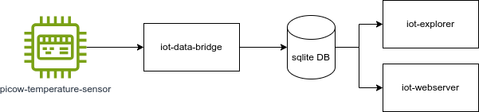

# picow-rust-iot-demonstrator

# Overview

This project showcases the capabilities of Rust, a system programming language known for its safety and performance, in the realm of Internet of Things (IoT) by using a PicoW as the embedded device. It aims to provide a concise example of how Rust can be utilized to develop IoT applications. Leveraging the PicoW's Wi-Fi connectivity the project demonstrates real-world IoT scenarios, including sensor data collection, and seamless data communication over the internet. This initiative not only highlights Rust's suitability for embedded systems but also serves as a stepping stone for developers looking to explore IoT development.




The setup consists of the components: 

 * PicoW Sensor (`picow-temperature-sensor`)

   As sample data the temperature is measured periodically.   
   The value is forwarded to the IoT Data Bridge via Wifi and TCP.
 * Sensor Simulator (`sensor-simulator`)

   If no PicoW is available you can also use a sensor simulator.
 * IoT Data Bridge (`iot-data-bridge`)

   Acts as a bridge for data, receiving temperature readings from the sensor and forwarding them to a sqlite database.
 * Sqlite DB

   As datastorage a filebased sqlite database is used accessed from rust with `iot-db-accessor`.
 * IoT WebServer and WebPage (`iot-webserver`)

   serves the web services and a web page with a dashboard of the sensor data.
 * IoT Explorer (`iot-explorer`)

   A CLI application that lists the sensor data and can also create testdata.
   
When new sensor data becomes available in the database, the `iot-explorer` and "IoT WebPage" automatically update whenever they are open.

# Building and Executing the IoT Demonstrator

**⚠️ WARNING:** Minimum supported rust version: 1.74. To update: `rustup toolchain update stable`

Building is separated into two steps:
Pico part and the host part (everything else).
So if you have no PicoW you can test it with the `sensor-simulator`.

If you use vscode with for the described steps are corresponding tasks configured (in [[.vscode/tasks.json]]). This can be executed with Ctrl+Shift+B ("Run Tasks").

**⚠️ WARNING:** Execute the `cargo` commands from the project root. Otherwise, the database will not be found, as it is configured via a relative path.

## Install sqlx-cli

```bash
cargo install sqlx-cli
```

## Build host part

```bash
cargo build
```

## Start `iot-webserver`

Start in one bash terminal the `iot-webserver` (or with vscode excute task "01-iot-webserver"):

```bash
cargo run --bin iot-webserver
```

After starting the iot-webserver, you will see a link to the dashboard page, e.g.: http://localhost:3000


To see what's going on behind the scenes start with tracing:

```bash
RUST_LOG=DEBUG cargo run --bin iot-webserver
```

## Start `iot-explorer`

You can also view the latest data via cli (or with vscode excute task "02-iot-explorer"):

```bash
cargo run --bin iot-explorer last --follow
```

With `cargo run --bin iot-explorer` you see the help page.

With `cargo run --bin iot-explorer help last` you see the help page for the last command.

## Start `iot-data-bridge`

Start in one bash terminal the `iot-data-bridge` (or with vscode excute task "03-iot-data-bridge"):

```bash
cargo run --bin iot-data-bridge
```

## Start Sensor Data Producer (PicoW or Simulator)

⚠️ **Attention:** Data acquisition must use only one source: a) `sensor-simulator`, OR b) `picow-temperature-sensor`

### a) `sensor-simulator`

Start in one bash terminal the `sensor-simulator` (or with vscode excute task "04a-sensor-simulator"):

```bash
cargo run --release --bin sensor-simulator
```

### b) `picow-temperature-sensor`

This project is not part of the cargo workspace.

#### Setup the Rust Environment for PicoW

Please ensure that you have set up the rust development environment for the PicoW and tested it, e.g. by running the blinky example from the embassy project (details [here](./picow-temperature-sensor/README.md))

### Edit `.env` file

⚠️ **WARNING:** Before you can use the PicoW project, please ensure that you **edit the `.env` file and complete the TODOs**, i.e. set WIFI SSID and password for the WLAN that is used to connect to the PicoW as well as the installation directory of embassy.

### Build and flash the PicoW

Use the following terminal commands (or with vscode excute task "04b-picow-temperature-sensor"):

```bash
cd picow-temperature-sensor
cargo run --release
```

After flashing the Pico tries to periodically send data to the `iot-data-bridge`. To stop this, disconnect the power cable.

